# Documentation dependency map

This published snapshot shows the declarations at commit
[`1cdedd48abc3b41b66aa4c4fa4f20fe748c176bd`](https://github.com/tequers/exam-roi-pipeline/tree/1cdedd48abc3b41b66aa4c4fa4f20fe748c176bd).
It contains 64 files and 162 review relationships. It predates this map page and
later declaration changes. Each line means that a change may require reviewing
the connected file. The table below the diagram gives the reason and trigger.

The declarations in source documents remain authoritative. For current results,
run `python scripts/doc_dependencies.py impact --file PATH`. See the
[dependency specification](../specs/doc-dependencies.md) for the review workflow.

<!-- published-graph:start -->

Generated from declarations. Review associations are undirected; they do not certify semantic consistency.

Snapshot:

```json
{
  "after_digest": "f7e9cf78c5b7bc31f2aea42bc1966b1109cd663d97a1f6d0d9264d1ba1f83a2c",
  "base_commit": null,
  "before_digest": null,
  "effective_base": null,
  "head_commit": "1cdedd48abc3b41b66aa4c4fa4f20fe748c176bd",
  "mode": "commit",
  "requested_base": null,
  "requested_head": "1cdedd48abc3b41b66aa4c4fa4f20fe748c176bd",
  "untracked_excluded": false
}
```



```mermaid
flowchart LR
    n0001[".agents/skills/exam-next-ticket/SKILL.md"]
    n0002[".agents/skills/graft/SKILL.md"]
    n0003[".env.example"]
    n0004[".github/workflows/tickets.yml"]
    n0005[".gitignore"]
    n0006["AGENTS.md"]
    n0007["CONTEXT.md"]
    n0008["LICENSE"]
    n0009["README.md"]
    n0010["docs/README.md"]
    n0011["docs/adr/0001-course-exam-hierarchy.md"]
    n0012["docs/adr/0006-course-folder-as-cli-argument.md"]
    n0013["docs/adr/0007-one-record-per-paper-and-the-sitting-year.md"]
    n0014["docs/adr/0008-modular-pipeline-architecture.md"]
    n0015["docs/adr/README.md"]
    n0016["docs/adr/SUPPRESSED/0003-active-exam-resolution.md"]
    n0017["docs/adr/SUPPRESSED/README.md"]
    n0018["docs/architecture.md"]
    n0019["docs/development/glossary.md"]
    n0020["docs/development/ticket-ground-truth-plan.md"]
    n0021["docs/development/ticket-workflow.md"]
    n0022["docs/development/workflow.md"]
    n0023["docs/glossary.md"]
    n0024["docs/guides/course-state-recovery.md"]
    n0025["docs/guides/glm-testing.md"]
    n0026["docs/guides/independent-review.md"]
    n0027["docs/guides/model-request-limits.md"]
    n0028["docs/guides/new-course-setup.md"]
    n0029["docs/guides/scoring-methodology.md"]
    n0030["docs/guides/staged-evaluation.md"]
    n0031["docs/repository-structure.md"]
    n0032["docs/research/branch-consolidation-2026-09-17.md"]
    n0033["docs/research/git-and-pull-requests-for-ai-development.md"]
    n0034["docs/specs/doc-dependencies-reference.md"]
    n0035["docs/specs/doc-dependencies.md"]
    n0036["pipeline/exam_roi/contracts/evaluation-v1.2.0.md"]
    n0037["pipeline/exam_roi/evaluation.py"]
    n0038["pipeline/exam_roi/identity.py"]
    n0039["pipeline/exam_roi/inputs.py"]
    n0040["pipeline/exam_roi/llm.py"]
    n0041["pipeline/exam_roi/question_context.py"]
    n0042["pipeline/exam_roi/reports.py"]
    n0043["pipeline/exam_roi/review.py"]
    n0044["pipeline/exam_roi/scoring.py"]
    n0045["pipeline/exam_roi/storage.py"]
    n0046["pipeline/exam_roi/taxonomy.py"]
    n0047["pipeline/pipeline.py"]
    n0048["pipeline/requirements.txt"]
    n0049["pipeline/staged_evaluation.py"]
    n0050["pipeline/tests/fixtures/staged_evaluation/astra-evidence.json"]
    n0051["pipeline/tests/fixtures/staged_evaluation/equations-case.json"]
    n0052["pipeline/tests/test_cumulative_taxonomy.py"]
    n0053["pipeline/tests/test_exam_identity.py"]
    n0054["pipeline/tests/test_independent_review.py"]
    n0055["pipeline/tests/test_request_limits.py"]
    n0056["pipeline/tests/test_staged_evaluation.py"]
    n0057["pipeline/tests/test_storage.py"]
    n0058["scripts/check_tickets.py"]
    n0059["scripts/doc_dependencies.py"]
    n0060["scripts/doc_dependency_graph.py"]
    n0061["scripts/tests/test_doc_dependencies.py"]
    n0062["scripts/tests/test_doc_dependency_graph.py"]
    n0063["scripts/ticket_history.py"]
    n0064["scripts/tickets.py"]
    n0001 --- n0021
    n0001 --- n0022
    n0001 --- n0031
    n0002 --- n0022
    n0003 --- n0022
    n0003 --- n0025
    n0003 --- n0027
    n0004 --- n0021
    n0004 --- n0022
    n0004 --- n0033
    n0005 --- n0009
    n0005 --- n0031
    n0006 --- n0022
    n0007 --- n0031
    n0008 --- n0009
    n0009 --- n0011
    n0009 --- n0012
    n0009 --- n0013
    n0009 --- n0014
    n0009 --- n0018
    n0009 --- n0021
    n0009 --- n0022
    n0009 --- n0023
    n0009 --- n0024
    n0009 --- n0026
    n0009 --- n0028
    n0009 --- n0029
    n0009 --- n0031
    n0009 --- n0036
    n0009 --- n0038
    n0009 --- n0039
    n0009 --- n0042
    n0009 --- n0045
    n0009 --- n0047
    n0009 --- n0048
    n0010 --- n0015
    n0010 --- n0018
    n0010 --- n0022
    n0010 --- n0026
    n0010 --- n0035
    n0011 --- n0012
    n0011 --- n0015
    n0011 --- n0023
    n0011 --- n0045
    n0012 --- n0015
    n0012 --- n0016
    n0012 --- n0028
    n0012 --- n0039
    n0012 --- n0045
    n0012 --- n0047
    n0013 --- n0015
    n0013 --- n0038
    n0013 --- n0047
    n0013 --- n0053
    n0014 --- n0015
    n0014 --- n0018
    n0014 --- n0036
    n0014 --- n0037
    n0014 --- n0038
    n0014 --- n0039
    n0014 --- n0040
    n0014 --- n0041
    n0014 --- n0042
    n0014 --- n0043
    n0014 --- n0044
    n0014 --- n0045
    n0014 --- n0046
    n0014 --- n0047
    n0014 --- n0049
    n0015 --- n0017
    n0018 --- n0023
    n0018 --- n0026
    n0018 --- n0028
    n0018 --- n0029
    n0018 --- n0030
    n0018 --- n0036
    n0018 --- n0037
    n0018 --- n0038
    n0018 --- n0039
    n0018 --- n0040
    n0018 --- n0041
    n0018 --- n0042
    n0018 --- n0043
    n0018 --- n0044
    n0018 --- n0045
    n0018 --- n0046
    n0018 --- n0047
    n0018 --- n0049
    n0019 --- n0022
    n0019 --- n0035
    n0019 --- n0064
    n0020 --- n0021
    n0020 --- n0031
    n0021 --- n0022
    n0021 --- n0031
    n0021 --- n0058
    n0021 --- n0063
    n0021 --- n0064
    n0022 --- n0025
    n0022 --- n0027
    n0022 --- n0028
    n0022 --- n0030
    n0022 --- n0031
    n0022 --- n0032
    n0022 --- n0033
    n0022 --- n0035
    n0022 --- n0040
    n0022 --- n0047
    n0022 --- n0048
    n0022 --- n0058
    n0022 --- n0064
    n0023 --- n0028
    n0023 --- n0036
    n0023 --- n0044
    n0023 --- n0046
    n0024 --- n0028
    n0024 --- n0029
    n0024 --- n0038
    n0024 --- n0045
    n0024 --- n0046
    n0024 --- n0047
    n0024 --- n0057
    n0025 --- n0040
    n0025 --- n0047
    n0026 --- n0036
    n0026 --- n0040
    n0026 --- n0043
    n0026 --- n0047
    n0026 --- n0054
    n0027 --- n0036
    n0027 --- n0040
    n0027 --- n0041
    n0027 --- n0047
    n0027 --- n0055
    n0028 --- n0039
    n0028 --- n0045
    n0028 --- n0047
    n0029 --- n0036
    n0029 --- n0042
    n0029 --- n0044
    n0029 --- n0046
    n0029 --- n0047
    n0029 --- n0052
    n0030 --- n0036
    n0030 --- n0037
    n0030 --- n0047
    n0030 --- n0049
    n0030 --- n0050
    n0030 --- n0051
    n0030 --- n0056
    n0031 --- n0034
    n0031 --- n0035
    n0031 --- n0063
    n0031 --- n0064
    n0032 --- n0033
    n0034 --- n0035
    n0034 --- n0059
    n0034 --- n0060
    n0034 --- n0061
    n0034 --- n0062
    n0035 --- n0059
    n0035 --- n0060
```

Legend: nodes are files; lines mean that a change may require reviewing the other file.

| Owner | Target | Reason | Review when | Source |
|---|---|---|---|---|
| docs/development/ticket\-workflow\.md | \.agents/skills/exam\-next\-ticket/SKILL\.md | Routes agent\-led work to the scoped ticket workflow\. | Selection, approval, verification, or handoff instructions change\. | docs/development/ticket\-workflow\.md:211 |
| docs/development/workflow\.md | \.agents/skills/exam\-next\-ticket/SKILL\.md | Explains when the local ticket skill runs and what it requires\. | Skill trigger, approval, delegation, or closure instructions change\. | docs/development/workflow\.md:386 |
| docs/repository\-structure\.md | \.agents/skills/exam\-next\-ticket/SKILL\.md | Identifies the repository\-scoped ticket skill and its discovery path\. | Skill name, location, scope checks, or backlog discovery change\. | docs/repository\-structure\.md:100 |
| docs/development/workflow\.md | \.agents/skills/graft/SKILL\.md | Identifies the local code\-discovery skill and when to use it\. | Skill trigger, location, or retrieval instructions change\. | docs/development/workflow\.md:387 |
| docs/development/workflow\.md | \.env\.example | Supplies the provider configuration template used in live setup\. | Environment variable names, providers, or defaults change\. | docs/development/workflow\.md:392 |
| docs/guides/glm\-testing\.md | \.env\.example | Shows the provider and model variables checked before the smoke test\. | UnoRouter variable names, model settings, or credential examples change\. | docs/guides/glm\-testing\.md:30 |
| docs/guides/model\-request\-limits\.md | \.env\.example | Exposes the documented per\-stage request budget settings\. | Budget variable names, examples, or defaults change\. | docs/guides/model\-request\-limits\.md:114 |
| docs/development/ticket\-workflow\.md | \.github/workflows/tickets\.yml | Describes the ticket CI matrix and advisory impact step\. | Platforms, Python versions, check gates, or impact handling change\. | docs/development/ticket\-workflow\.md:210 |
| docs/development/workflow\.md | \.github/workflows/tickets\.yml | States the CI platforms, Python versions, and limits of automation\. | CI matrix, required checks, or impact reporting change\. | docs/development/workflow\.md:390 |
| docs/research/git\-and\-pull\-requests\-for\-ai\-development\.md | \.github/workflows/tickets\.yml | Distinguishes existing ticket CI from proposed additional checks\. | CI gains pipeline tests or changes its current verification scope\. | docs/research/git\-and\-pull\-requests\-for\-ai\-development\.md:284 |
| README\.md | \.gitignore | Supports the policy that private course data and generated outputs stay out of Git\. | Ignore rules or documented data\-tracking boundaries change\. | README\.md:385 |
| docs/repository\-structure\.md | \.gitignore | States which course data, scratch files, and generated artifacts stay local\. | Ignore rules or tracking policy change\. | docs/repository\-structure\.md:96 |
| docs/development/workflow\.md | AGENTS\.md | Explains the repository instructions for agreement, implementation, and review\. | Approval, branch, verification, review, or completion rules change\. | docs/development/workflow\.md:380 |
| docs/repository\-structure\.md | CONTEXT\.md | Assigns the root context file a glossary\-discovery role\. | The pointer location or authoritative vocabulary home changes\. | docs/repository\-structure\.md:97 |
| README\.md | LICENSE | Displays the project license badge\. | The license terms or declared license change\. | README\.md:384 |
| README\.md | docs/adr/0001\-course\-exam\-hierarchy\.md | Applies the one\-exam state boundary to course folder conventions\. | Course hierarchy or sharing between exam types changes\. | README\.md:377 |
| README\.md | docs/adr/0006\-course\-folder\-as\-cli\-argument\.md | Documents the decided course\-folder argument and independent destination\. | Course selection or output\-location policy changes\. | README\.md:378 |
| README\.md | docs/adr/0007\-one\-record\-per\-paper\-and\-the\-sitting\-year\.md | Describes current paper identity and year behavior beside the accepted naming decision\. | The decision, its implementation status, or runtime identity rules change\. | README\.md:368 |
| README\.md | docs/adr/0008\-modular\-pipeline\-architecture\.md | Summarizes the current division into focused pipeline modules\. | Module boundaries or their implementation status change\. | README\.md:379 |
| README\.md | docs/architecture\.md | Summarizes the available two\-stage workflow and its limits\. | Command availability, candidate acceptance, or module boundaries change\. | README\.md:365 |
| README\.md | docs/development/ticket\-workflow\.md | Describes authoritative ticket records and the validation command\. | Ticket authority, workflow entry points, or validation instructions change\. | README\.md:380 |
| README\.md | docs/development/workflow\.md | Directs setup, offline checks, and approval before live analysis\. | Setup commands, provider approval, or required checks change\. | README\.md:370 |
| README\.md | docs/glossary\.md | Uses Course, Exam, Topic, and Priority with their shared meanings\. | Domain definitions or course isolation rules change\. | README\.md:366 |
| README\.md | docs/guides/course\-state\-recovery\.md | Summarizes storage protections and directs users to recovery procedures\. | Lock, transaction, or recovery guarantees change\. | README\.md:381 |
| README\.md | docs/guides/independent\-review\.md | Summarizes the retained reviewer and disabled production integration\. | Review availability or the meaning of review outcomes changes\. | README\.md:382 |
| docs/guides/new\-course\-setup\.md | README\.md | Relies on the detailed paper\-ID and replacement rules\. | Custom IDs, collisions, force behavior, or the linked section changes\. | docs/guides/new\-course\-setup\.md:123 |
| README\.md | docs/guides/scoring\-methodology\.md | Summarizes ranking arithmetic and evidence limits\. | Formula, score interpretation, or aggregation rules change\. | README\.md:367 |
| README\.md | docs/repository\-structure\.md | Publishes a condensed repository map and tracking rules\. | Maintained file locations or root exceptions change\. | README\.md:369 |
| README\.md | pipeline/exam\_roi/contracts/evaluation\-v1\.2\.0\.md | Summarizes difficulty anchors, evidence requirements, and versioned judgments\. | Active contract version, rubric, or evidence requirements change\. | README\.md:383 |
| README\.md | pipeline/exam\_roi/identity\.py | Documents safe paper IDs and record paths\. | ID validation, filename limits, or path guards change\. | README\.md:373 |
| README\.md | pipeline/exam\_roi/inputs\.py | Documents input selection, extraction checks, and provenance\. | Supported files, discovery order, exclusions, or text validation change\. | README\.md:372 |
| README\.md | pipeline/exam\_roi/reports\.py | Describes report formats, fields, and paper labels\. | Export schema, filenames, labels, or rendering behavior change\. | README\.md:375 |
| README\.md | pipeline/exam\_roi/storage\.py | Summarizes locking, state validation, and recovery guarantees\. | Locks, transactions, state versions, or recovery behavior change\. | README\.md:374 |
| README\.md | pipeline/pipeline\.py | Documents commands, flags, exit codes, and candidate\-only writes\. | CLI arguments, outcomes, defaults, or acceptance behavior change\. | README\.md:371 |
| README\.md | pipeline/requirements\.txt | Supplies the dependencies for documented installation\. | Dependency lists, pins, or installation requirements change\. | README\.md:376 |
| docs/README\.md | docs/adr/README\.md | Directs readers to the current\-versus\-suppressed decision index\. | Decision index location or status classification changes\. | docs/README\.md:42 |
| docs/README\.md | docs/architecture\.md | Describes the boundary between available and pending features\. | Architecture status or pending capability descriptions change\. | docs/README\.md:38 |
| docs/README\.md | docs/development/workflow\.md | Names the development route, required skills, and enforcement limits\. | Workflow stages, skill requirements, or enforcement claims change\. | docs/README\.md:41 |
| docs/README\.md | docs/guides/independent\-review\.md | Labels the retained reviewer as unavailable in the MVP CLI\. | Production review availability changes\. | docs/README\.md:40 |
| docs/README\.md | docs/specs/doc\-dependencies\.md | Advertises dependency checking and its rollout status\. | Tool availability, declaration coverage, or usage entry points change\. | docs/README\.md:39 |
| docs/adr/0006\-course\-folder\-as\-cli\-argument\.md | docs/adr/0001\-course\-exam\-hierarchy\.md | Uses the course folder as the independent exam state boundary\. | The course hierarchy or state\-sharing decision changes\. | docs/adr/0006\-course\-folder\-as\-cli\-argument\.md:56 |
| docs/adr/README\.md | docs/adr/0001\-course\-exam\-hierarchy\.md | Summarizes the course state\-boundary decision\. | Decision title, status, path, or scope changes\. | docs/adr/README\.md:23 |
| docs/glossary\.md | docs/adr/0001\-course\-exam\-hierarchy\.md | Defines Course and Exam around the accepted independent state boundary\. | Course hierarchy or sharing between exam types changes\. | docs/glossary\.md:59 |
| docs/adr/0001\-course\-exam\-hierarchy\.md | pipeline/exam\_roi/storage\.py | Isolated course storage implements the decided exam state boundary\. | State becomes shared, split, or merged across course folders\. | docs/adr/0001\-course\-exam\-hierarchy\.md:28 |
| docs/adr/README\.md | docs/adr/0006\-course\-folder\-as\-cli\-argument\.md | Summarizes the explicit course\-folder command decision\. | Decision title, status, path, or scope changes\. | docs/adr/README\.md:24 |
| docs/adr/0006\-course\-folder\-as\-cli\-argument\.md | docs/adr/SUPPRESSED/0003\-active\-exam\-resolution\.md | Records which earlier active\-folder decision this decision supersedes\. | The supersession relationship or historical decision status is corrected\. | docs/adr/0006\-course\-folder\-as\-cli\-argument\.md:60 |
| docs/guides/new\-course\-setup\.md | docs/adr/0006\-course\-folder\-as\-cli\-argument\.md | Applies the explicit course\-folder command decision\. | Course argument or destination policy changes\. | docs/guides/new\-course\-setup\.md:125 |
| docs/adr/0006\-course\-folder\-as\-cli\-argument\.md | pipeline/exam\_roi/inputs\.py | Implements default course input discovery and explicit external inputs\. | Default search folders or explicit path handling change\. | docs/adr/0006\-course\-folder\-as\-cli\-argument\.md:59 |
| docs/adr/0006\-course\-folder\-as\-cli\-argument\.md | pipeline/exam\_roi/storage\.py | Implements the managed state and report paths within a course folder\. | CoursePaths, managed filenames, or state containment change\. | docs/adr/0006\-course\-folder\-as\-cli\-argument\.md:58 |
| docs/adr/0006\-course\-folder\-as\-cli\-argument\.md | pipeline/pipeline\.py | Implements the required first positional course\-folder argument\. | Argument order, folder creation, or destination selection changes\. | docs/adr/0006\-course\-folder\-as\-cli\-argument\.md:57 |
| docs/adr/README\.md | docs/adr/0007\-one\-record\-per\-paper\-and\-the\-sitting\-year\.md | Indexes the filename decision and its implementation gap\. | Naming decision or implementation status changes\. | docs/adr/README\.md:25 |
| docs/adr/0007\-one\-record\-per\-paper\-and\-the\-sitting\-year\.md | pipeline/exam\_roi/identity\.py | Validates paper IDs without enforcing the decided year prefix\. | Safe\-ID rules or year\-prefix validation change\. | docs/adr/0007\-one\-record\-per\-paper\-and\-the\-sitting\-year\.md:66 |
| docs/adr/0007\-one\-record\-per\-paper\-and\-the\-sitting\-year\.md | pipeline/pipeline\.py | Selects paper IDs and years but does not yet enforce the accepted filename decision\. | Prefix enforcement, year inference, overrides, or ID collision handling change\. | docs/adr/0007\-one\-record\-per\-paper\-and\-the\-sitting\-year\.md:65 |
| docs/adr/0007\-one\-record\-per\-paper\-and\-the\-sitting\-year\.md | pipeline/tests/test\_exam\_identity\.py | Records the currently supported ID and replacement behavior\. | Naming enforcement or its regression expectations change\. | docs/adr/0007\-one\-record\-per\-paper\-and\-the\-sitting\-year\.md:67 |
| docs/adr/README\.md | docs/adr/0008\-modular\-pipeline\-architecture\.md | Summarizes the module\-boundary decision\. | Decision title, status, path, or scope changes\. | docs/adr/README\.md:26 |
| docs/architecture\.md | docs/adr/0008\-modular\-pipeline\-architecture\.md | Describes the implemented form of the accepted module boundaries\. | Responsibilities, boundaries, or implementation status change\. | docs/architecture\.md:131 |
| docs/adr/0008\-modular\-pipeline\-architecture\.md | pipeline/exam\_roi/contracts/evaluation\-v1\.2\.0\.md | Implements the listed versioned runtime\-contract responsibility\. | The active contract, its location, or the runtime\-resource boundary changes\. | docs/adr/0008\-modular\-pipeline\-architecture\.md:100 |
| docs/adr/0008\-modular\-pipeline\-architecture\.md | pipeline/exam\_roi/evaluation\.py | Lists candidate construction and validation as the evaluation boundary\. | Validation responsibilities move or the candidate interface changes\. | docs/adr/0008\-modular\-pipeline\-architecture\.md:97 |
| docs/adr/0008\-modular\-pipeline\-architecture\.md | pipeline/exam\_roi/identity\.py | Lists safe exam IDs and contained paths as the identity responsibility\. | Identity responsibilities move or the module interface changes\. | docs/adr/0008\-modular\-pipeline\-architecture\.md:94 |
| docs/adr/0008\-modular\-pipeline\-architecture\.md | pipeline/exam\_roi/inputs\.py | Lists input discovery and extraction as a focused module responsibility\. | Input responsibilities move or the module interface changes\. | docs/adr/0008\-modular\-pipeline\-architecture\.md:93 |
| docs/adr/0008\-modular\-pipeline\-architecture\.md | pipeline/exam\_roi/llm\.py | Lists model clients, budgets, batching, and retries as the model\-access boundary\. | Model\-access responsibilities move or its interface changes\. | docs/adr/0008\-modular\-pipeline\-architecture\.md:96 |
| docs/adr/0008\-modular\-pipeline\-architecture\.md | pipeline/exam\_roi/question\_context\.py | Lists evidence context and question groups as a focused responsibility\. | Context responsibilities move or the module interface changes\. | docs/adr/0008\-modular\-pipeline\-architecture\.md:95 |
| docs/adr/0008\-modular\-pipeline\-architecture\.md | pipeline/exam\_roi/reports\.py | Implements rendering from supplied data without acceptance decisions\. | Report inputs, side effects, or responsibility boundaries change\. | docs/adr/0008\-modular\-pipeline\-architecture\.md:91 |
| docs/adr/0008\-modular\-pipeline\-architecture\.md | pipeline/exam\_roi/review\.py | Implements the retained review module described as disabled in the CLI\. | Reviewer responsibilities or production integration change\. | docs/adr/0008\-modular\-pipeline\-architecture\.md:92 |
| docs/adr/0008\-modular\-pipeline\-architecture\.md | pipeline/exam\_roi/scoring\.py | Implements the decision that scoring has no model or filesystem access\. | Scoring inputs, side effects, or module boundaries change\. | docs/adr/0008\-modular\-pipeline\-architecture\.md:89 |
| docs/adr/0008\-modular\-pipeline\-architecture\.md | pipeline/exam\_roi/storage\.py | Implements the single ownership boundary for guarded state and recovery\. | Storage ownership or separation from acceptance policy changes\. | docs/adr/0008\-modular\-pipeline\-architecture\.md:90 |
| docs/adr/0008\-modular\-pipeline\-architecture\.md | pipeline/exam\_roi/taxonomy\.py | Lists cumulative topic summaries and protected overrides as the taxonomy boundary\. | Aggregation responsibilities move or taxonomy inputs change\. | docs/adr/0008\-modular\-pipeline\-architecture\.md:98 |
| docs/adr/0008\-modular\-pipeline\-architecture\.md | pipeline/pipeline\.py | Coordinates the focused modules while retaining CLI, prompts, and workflow code\. | Coordination absorbs domain logic or a responsibility moves between modules\. | docs/adr/0008\-modular\-pipeline\-architecture\.md:88 |
| docs/adr/0008\-modular\-pipeline\-architecture\.md | pipeline/staged\_evaluation\.py | Separates evaluation execution from normal course processing\. | Evaluation entry points or production integration boundaries change\. | docs/adr/0008\-modular\-pipeline\-architecture\.md:99 |
| docs/adr/README\.md | docs/adr/SUPPRESSED/README\.md | Distinguishes current decisions from suppressed history\. | A decision is suppressed, restored, or replaced\. | docs/adr/README\.md:27 |
| docs/architecture\.md | docs/glossary\.md | Uses shared course, exam, topic, and accepted\-state terms\. | Domain meanings or state boundaries change\. | docs/architecture\.md:132 |
| docs/guides/independent\-review\.md | docs/architecture\.md | Separates retained review behavior from current MVP availability\. | Independent review becomes available or production boundaries change\. | docs/guides/independent\-review\.md:111 |
| docs/guides/new\-course\-setup\.md | docs/architecture\.md | Describes candidate creation separately from pending acceptance\. | Candidate acceptance or other available workflow steps change\. | docs/guides/new\-course\-setup\.md:127 |
| docs/guides/scoring\-methodology\.md | docs/architecture\.md | Distinguishes available candidate analysis and rebuild from pending acceptance\. | Production workflow or acceptance availability changes\. | docs/guides/scoring\-methodology\.md:139 |
| docs/architecture\.md | docs/guides/staged\-evaluation\.md | Summarizes the calibration limits and unapproved captured evidence\. | Capture approval, evaluation capabilities, or calibration status changes\. | docs/architecture\.md:146 |
| docs/architecture\.md | pipeline/exam\_roi/contracts/evaluation\-v1\.2\.0\.md | Names the contract governing candidate evidence and judgments\. | The active contract or its interpretation changes\. | docs/architecture\.md:144 |
| docs/architecture\.md | pipeline/exam\_roi/evaluation\.py | Describes validation, candidate construction, and review classification\. | Candidate schema, validation boundaries, or classification change\. | docs/architecture\.md:138 |
| docs/architecture\.md | pipeline/exam\_roi/identity\.py | Assigns exam\-ID and contained\-path validation to the identity module\. | Identity responsibilities or path validation change\. | docs/architecture\.md:135 |
| docs/architecture\.md | pipeline/exam\_roi/inputs\.py | Assigns discovery, extraction, and source provenance to the input module\. | Input responsibilities or supported extraction behavior change\. | docs/architecture\.md:134 |
| docs/architecture\.md | pipeline/exam\_roi/llm\.py | Describes explicit clients, request budgets, batching, and transport handling\. | Client interfaces or model\-access responsibilities change\. | docs/architecture\.md:137 |
| docs/architecture\.md | pipeline/exam\_roi/question\_context\.py | Assigns retained evidence and question grouping to the context module\. | Context construction or module responsibilities change\. | docs/architecture\.md:136 |
| docs/architecture\.md | pipeline/exam\_roi/reports\.py | Describes report writers consuming supplied scoring data\. | Writer inputs, export responsibilities, or acceptance behavior change\. | docs/architecture\.md:142 |
| docs/architecture\.md | pipeline/exam\_roi/review\.py | Describes a retained reviewer separate from production CLI availability\. | Reviewer responsibilities or integration boundaries change\. | docs/architecture\.md:143 |
| docs/architecture\.md | pipeline/exam\_roi/scoring\.py | Describes pure ranking and report\-data calculation\. | Scoring responsibilities or dependencies on storage and providers change\. | docs/architecture\.md:140 |
| docs/architecture\.md | pipeline/exam\_roi/storage\.py | Describes isolated course state, locks, transactions, and recovery\. | Stored state, session ownership, or transaction guarantees change\. | docs/architecture\.md:141 |
| docs/architecture\.md | pipeline/exam\_roi/taxonomy\.py | Describes aggregation from compatible accepted evidence and protected overrides\. | Aggregation inputs, compatibility, or override behavior change\. | docs/architecture\.md:139 |
| docs/architecture\.md | pipeline/pipeline\.py | Describes CLI coordination, stage order, enabled features, and rebuild behavior\. | Commands, orchestration, candidate acceptance, or startup configuration change\. | docs/architecture\.md:133 |
| docs/architecture\.md | pipeline/staged\_evaluation\.py | Separates evaluation capture and replay from course processing\. | Evaluation entry points, production reuse, or approval boundaries change\. | docs/architecture\.md:145 |
| docs/development/workflow\.md | docs/development/glossary\.md | Uses the agreed meanings of scope, specification, decision, and verification\. | Workflow terminology or evidence distinctions change\. | docs/development/workflow\.md:381 |
| docs/specs/doc\-dependencies\.md | docs/development/glossary\.md | Uses decided, implemented, verified, and shared\-agreement meanings\. | Approval or verification terminology changes\. | docs/specs/doc\-dependencies\.md:225 |
| docs/development/glossary\.md | scripts/tickets\.py | Defines implemented ticket states, preflight, and closure evidence\. | State transitions or meanings of verification and completion change\. | docs/development/glossary\.md:36 |
| docs/development/ticket\-ground\-truth\-plan\.md | docs/development/ticket\-workflow\.md | Directs readers of the historical plan to current ticket procedures\. | Current workflow location or the historical\-versus\-current distinction changes\. | docs/development/ticket\-ground\-truth\-plan\.md:223 |
| docs/development/ticket\-ground\-truth\-plan\.md | docs/repository\-structure\.md | Directs readers of old backlog paths to the maintained location policy\. | Backlog locations or historical\-path guidance change\. | docs/development/ticket\-ground\-truth\-plan\.md:224 |
| docs/development/workflow\.md | docs/development/ticket\-workflow\.md | Summarizes ticket selection, verification, state transitions, and closure\. | Ticket commands or lifecycle procedures change\. | docs/development/workflow\.md:382 |
| docs/repository\-structure\.md | docs/development/ticket\-workflow\.md | Assigns this file the maintained ticket\-procedure role\. | The ticket guide location or assigned documentation role changes\. | docs/repository\-structure\.md:99 |
| docs/development/ticket\-workflow\.md | scripts/check\_tickets\.py | Describes the combined offline test and backlog validation command\. | Test discovery or validation execution changes\. | docs/development/ticket\-workflow\.md:209 |
| docs/development/ticket\-workflow\.md | scripts/ticket\_history\.py | Describes commit\-based impact and verification against historical state\. | Comparison, rename, historical lookup, or change classification rules change\. | docs/development/ticket\-workflow\.md:208 |
| docs/development/ticket\-workflow\.md | scripts/tickets\.py | Documents authoritative ticket metadata, commands, and lifecycle rules\. | Metadata schema, command behavior, evidence freshness, or state rules change\. | docs/development/ticket\-workflow\.md:207 |
| docs/guides/glm\-testing\.md | docs/development/workflow\.md | Requires provider, exact model, cost, and data\-sharing approval\. | Live\-run approval or provider setup steps change\. | docs/guides/glm\-testing\.md:27 |
| docs/development/workflow\.md | docs/guides/model\-request\-limits\.md | Directs live setup to the request\-budget rules\. | Budget variables, defaults, or setup requirements change\. | docs/development/workflow\.md:395 |
| docs/guides/new\-course\-setup\.md | docs/development/workflow\.md | Requires offline setup and separate live\-provider approval\. | Setup, credentials, approval, or offline verification steps change\. | docs/guides/new\-course\-setup\.md:126 |
| docs/guides/staged\-evaluation\.md | docs/development/workflow\.md | Uses the same live\-call approval and private\-data boundaries\. | Provider approval, permitted inputs, or evidence handling changes\. | docs/guides/staged\-evaluation\.md:194 |
| docs/repository\-structure\.md | docs/development/workflow\.md | Assigns this file the maintained development\-instructions role\. | The workflow file location or assigned documentation role changes\. | docs/repository\-structure\.md:98 |
| docs/development/workflow\.md | docs/research/branch\-consolidation\-2026\-09\-17\.md | Uses recorded branch lineage to explain the MVP base and retained main history\. | A correction to the recorded lineage changes branch\-selection guidance\. | docs/development/workflow\.md:384 |
| docs/development/workflow\.md | docs/research/git\-and\-pull\-requests\-for\-ai\-development\.md | Applies the research conclusions about reviewable changes and recovery\. | Adopted Git practices or the boundary between proposals and current rules changes\. | docs/development/workflow\.md:385 |
| docs/development/workflow\.md | docs/specs/doc\-dependencies\.md | Describes how dependency checks support documentation review\. | Commands, coverage, review duties, or enforcement status change\. | docs/development/workflow\.md:383 |
| docs/development/workflow\.md | pipeline/exam\_roi/llm\.py | Documents supported providers, credentials, and model configuration\. | Providers, credential aliases, model setup, or request budgeting change\. | docs/development/workflow\.md:394 |
| docs/development/workflow\.md | pipeline/pipeline\.py | Documents offline commands, live startup, and disabled MVP features\. | CLI help, environment loading, provider setup, or availability gates change\. | docs/development/workflow\.md:393 |
| docs/development/workflow\.md | pipeline/requirements\.txt | Supplies the dependencies used by the setup instructions\. | Dependency lists, pins, or installation requirements change\. | docs/development/workflow\.md:391 |
| docs/development/workflow\.md | scripts/check\_tickets\.py | Defines the local tooling check developers must run\. | Tests executed, validation behavior, or exit handling change\. | docs/development/workflow\.md:389 |
| docs/development/workflow\.md | scripts/tickets\.py | Publishes ticket commands and their enforcement limits\. | CLI arguments, preflight, transitions, or verification behavior change\. | docs/development/workflow\.md:388 |
| docs/guides/new\-course\-setup\.md | docs/glossary\.md | Uses Course and Exam to define independent setup folders\. | Course, exam, or state\-boundary definitions change\. | docs/guides/new\-course\-setup\.md:124 |
| docs/glossary\.md | pipeline/exam\_roi/contracts/evaluation\-v1\.2\.0\.md | Defines evaluation, difficulty, connectivity, and evidence terms\. | Contract meanings, scales, or provenance requirements change\. | docs/glossary\.md:60 |
| docs/glossary\.md | pipeline/exam\_roi/scoring\.py | Defines Priority using the implemented formula\. | Ranking arithmetic or metric interpretation changes\. | docs/glossary\.md:61 |
| docs/glossary\.md | pipeline/exam\_roi/taxonomy\.py | Describes paper judgments, cumulative summaries, and human overrides\. | Evidence aggregation or override semantics change\. | docs/glossary\.md:62 |
| docs/guides/new\-course\-setup\.md | docs/guides/course\-state\-recovery\.md | Directs failed setup and rebuilds to the recovery procedure\. | Recovery actions or supported state repairs change\. | docs/guides/new\-course\-setup\.md:128 |
| docs/guides/scoring\-methodology\.md | docs/guides/course\-state\-recovery\.md | Supplies current transaction and concurrency guarantees\. | Storage guarantees or recovery limitations change\. | docs/guides/scoring\-methodology\.md:140 |
| docs/guides/course\-state\-recovery\.md | pipeline/exam\_roi/identity\.py | Relies on contained record paths and rejection of redirected files\. | Path guards, supported IDs, symlink, or hard\-link handling change\. | docs/guides/course\-state\-recovery\.md:146 |
| docs/guides/course\-state\-recovery\.md | pipeline/exam\_roi/storage\.py | Specifies the storage session, lock, journal, and recovery procedure\. | Transaction phases, integrity checks, supported state versions, or recovery actions change\. | docs/guides/course\-state\-recovery\.md:145 |
| docs/guides/course\-state\-recovery\.md | pipeline/exam\_roi/taxonomy\.py | Describes compatible evidence and legacy\-record exclusions on rebuild\. | Contract compatibility or aggregation behavior changes\. | docs/guides/course\-state\-recovery\.md:148 |
| docs/guides/course\-state\-recovery\.md | pipeline/pipeline\.py | Documents state and export exit codes and recovery commands\. | Lock ownership, command recovery, exit codes, or candidate writes change\. | docs/guides/course\-state\-recovery\.md:147 |
| docs/guides/course\-state\-recovery\.md | pipeline/tests/test\_storage\.py | Cites process\-interruption, competing\-writer, and recovery evidence\. | Tested failure boundaries or the guarantees established by tests change\. | docs/guides/course\-state\-recovery\.md:149 |
| docs/guides/glm\-testing\.md | pipeline/exam\_roi/llm\.py | Supplies UnoRouter configuration and credential aliases\. | Provider identifiers, credential aliases, or SDK configuration change\. | docs/guides/glm\-testing\.md:29 |
| docs/guides/glm\-testing\.md | pipeline/pipeline\.py | Supplies the production smoke command and saved model provenance\. | Environment loading, CLI invocation, or provenance fields change\. | docs/guides/glm\-testing\.md:28 |
| docs/guides/independent\-review\.md | pipeline/exam\_roi/contracts/evaluation\-v1\.2\.0\.md | Supplies the evaluation rules against which candidates are reviewed\. | Active contract, rubric, or evidence interpretation changes\. | docs/guides/independent\-review\.md:115 |
| docs/guides/independent\-review\.md | pipeline/exam\_roi/llm\.py | Supplies reviewer clients, token limits, and transport behavior\. | Client protocol, request budgets, retries, or response checks change\. | docs/guides/independent\-review\.md:114 |
| docs/guides/independent\-review\.md | pipeline/exam\_roi/review\.py | Documents review assessments, correction history, and failure handling\. | Review schema, validation, correction limits, or failure outcomes change\. | docs/guides/independent\-review\.md:112 |
| docs/guides/independent\-review\.md | pipeline/pipeline\.py | Documents the disabled review flags and saved candidate review status\. | CLI gates, review configuration, or process interfaces change\. | docs/guides/independent\-review\.md:113 |
| docs/guides/independent\-review\.md | pipeline/tests/test\_independent\_review\.py | Establishes retained review behavior through injected clients\. | Protocol, routing, correction, or failure regression coverage changes\. | docs/guides/independent\-review\.md:116 |
| docs/guides/model\-request\-limits\.md | pipeline/exam\_roi/contracts/evaluation\-v1\.2\.0\.md | Preserves the difficulty baseline and evidence requirements during batching\. | Contract text, evidence rules, or background\-assumption requirements change\. | docs/guides/model\-request\-limits\.md:112 |
| docs/guides/model\-request\-limits\.md | pipeline/exam\_roi/llm\.py | Explains request budgets, token counting, completion checks, and injected clients\. | Limit defaults, interfaces, retries, or truncation handling change\. | docs/guides/model\-request\-limits\.md:109 |
| docs/guides/model\-request\-limits\.md | pipeline/exam\_roi/question\_context\.py | Explains complete question groups and retained evidence context\. | Heading recognition, cross\-references, or context construction changes\. | docs/guides/model\-request\-limits\.md:110 |
| docs/guides/model\-request\-limits\.md | pipeline/pipeline\.py | Explains per\-stage limits, batching, and configuration integration\. | Stage signatures, environment defaults, or splitting behavior change\. | docs/guides/model\-request\-limits\.md:111 |
| docs/guides/model\-request\-limits\.md | pipeline/tests/test\_request\_limits\.py | Cites offline coverage of limits, context retention, and batch recovery\. | Regression cases or the behavior those checks establish change\. | docs/guides/model\-request\-limits\.md:113 |
| docs/guides/new\-course\-setup\.md | pipeline/exam\_roi/inputs\.py | Defines the supported sources and dry\-run selection rules\. | Input formats, discovery, exclusions, or extraction validation change\. | docs/guides/new\-course\-setup\.md:130 |
| docs/guides/new\-course\-setup\.md | pipeline/exam\_roi/storage\.py | Defines the course artifacts and candidate\-versus\-accepted state\. | Stored paths, write boundaries, or course initialization change\. | docs/guides/new\-course\-setup\.md:131 |
| docs/guides/new\-course\-setup\.md | pipeline/pipeline\.py | Provides the exact setup, analysis, status, rebuild, and override commands\. | Arguments, defaults, validation, outcomes, or availability gates change\. | docs/guides/new\-course\-setup\.md:129 |
| docs/guides/scoring\-methodology\.md | pipeline/exam\_roi/contracts/evaluation\-v1\.2\.0\.md | Explains the authoritative evaluation rubric and evidence rules\. | Contract version, scales, ambiguity, or evidence requirements change\. | docs/guides/scoring\-methodology\.md:141 |
| docs/guides/scoring\-methodology\.md | pipeline/exam\_roi/reports\.py | Describes the exported evidence and review notes\. | Export fields or XLSX and JSON representations change\. | docs/guides/scoring\-methodology\.md:145 |
| docs/guides/scoring\-methodology\.md | pipeline/exam\_roi/scoring\.py | Explains ranking arithmetic, format weights, and tiers\. | Formula, weights, allocation, or tier selection changes\. | docs/guides/scoring\-methodology\.md:142 |
| docs/guides/scoring\-methodology\.md | pipeline/exam\_roi/taxonomy\.py | Explains cumulative connections, difficulty groups, and human overrides\. | Aggregation, edge replacement, compatibility, or override rules change\. | docs/guides/scoring\-methodology\.md:143 |
| docs/guides/scoring\-methodology\.md | pipeline/pipeline\.py | Distinguishes active analysis and rebuild from retained connection\-review behavior\. | Acceptance, reprocessing, connection refresh, or rebuild integration changes\. | docs/guides/scoring\-methodology\.md:144 |
| docs/guides/scoring\-methodology\.md | pipeline/tests/test\_cumulative\_taxonomy\.py | Supplies regression evidence for cumulative judgments and overrides\. | Tested aggregation, replacement, or conflict behavior changes\. | docs/guides/scoring\-methodology\.md:146 |
| docs/guides/staged\-evaluation\.md | pipeline/exam\_roi/contracts/evaluation\-v1\.2\.0\.md | Defines the contract embedded in evaluation requests and evidence\. | Active contract version or captured evaluation requirements change\. | docs/guides/staged\-evaluation\.md:190 |
| docs/guides/staged\-evaluation\.md | pipeline/exam\_roi/evaluation\.py | Defines candidate validation used by capture and replay\. | Candidate schema, evidence matching, or deterministic validation change\. | docs/guides/staged\-evaluation\.md:189 |
| docs/guides/staged\-evaluation\.md | pipeline/pipeline\.py | Reuses production extraction, tagging, scoring, and prompts\. | Stage interfaces, prompt contents, or production outputs change\. | docs/guides/staged\-evaluation\.md:188 |
| docs/guides/staged\-evaluation\.md | pipeline/staged\_evaluation\.py | Documents exchange, live, audit, approval, replay, and exit semantics\. | Commands, report schema, hashes, approval, or replay behavior change\. | docs/guides/staged\-evaluation\.md:187 |
| docs/guides/staged\-evaluation\.md | pipeline/tests/fixtures/staged\_evaluation/astra\-evidence\.json | Interprets the saved responses and unapproved representation disagreements\. | Captured responses, outcomes, provenance, or approval status change\. | docs/guides/staged\-evaluation\.md:192 |
| docs/guides/staged\-evaluation\.md | pipeline/tests/fixtures/staged\_evaluation/equations\-case\.json | Describes the synthetic source and frozen expectations\. | Source facts, frozen extraction, or accepted judgment choices change\. | docs/guides/staged\-evaluation\.md:191 |
| docs/guides/staged\-evaluation\.md | pipeline/tests/test\_staged\_evaluation\.py | Cites offline audit, replay, and approval regression evidence\. | Verified protocol behavior or network\-isolation checks change\. | docs/guides/staged\-evaluation\.md:193 |
| docs/specs/doc\-dependencies\-reference\.md | docs/repository\-structure\.md | Uses the repository policy for ignored generated map locations\. | Generated\-output locations or tracking rules change\. | docs/specs/doc\-dependencies\-reference\.md:426 |
| docs/specs/doc\-dependencies\.md | docs/repository\-structure\.md | Places maintained declarations and ignored generated maps\. | Documentation coverage locations or generated\-output policy changes\. | docs/specs/doc\-dependencies\.md:224 |
| docs/repository\-structure\.md | scripts/ticket\_history\.py | Describes recognition of current and historical backlog paths\. | Historical location detection or fallback rules change\. | docs/repository\-structure\.md:102 |
| docs/repository\-structure\.md | scripts/tickets\.py | Documents the permanent backlog default and supported operations\. | Default backlog location or path\-resolution behavior changes\. | docs/repository\-structure\.md:101 |
| docs/research/git\-and\-pull\-requests\-for\-ai\-development\.md | docs/research/branch\-consolidation\-2026\-09\-17\.md | Uses the dated consolidation record to distinguish retained history from proposals\. | Corrections to historical branch evidence change the research context\. | docs/research/git\-and\-pull\-requests\-for\-ai\-development\.md:283 |
| docs/specs/doc\-dependencies\-reference\.md | docs/specs/doc\-dependencies\.md | Both documents form one contract; this path owns their mutual relationship by Unicode order\. | Coverage, ownership, commands, outputs, or acceptance rules change\. | docs/specs/doc\-dependencies\-reference\.md:427 |
| docs/specs/doc\-dependencies\-reference\.md | scripts/doc\_dependencies\.py | Implements the exact Git, CLI, artifact, JSON, and failure contract\. | Snapshot selection, flags, schema, rendering, or exit precedence changes\. | docs/specs/doc\-dependencies\-reference\.md:422 |
| docs/specs/doc\-dependencies\-reference\.md | scripts/doc\_dependency\_graph\.py | Implements the exact declaration grammar and graph rules\. | Coverage, parsing, ownership validation, traversal, digest, or discovery changes\. | docs/specs/doc\-dependencies\-reference\.md:423 |
| docs/specs/doc\-dependencies\-reference\.md | scripts/tests/test\_doc\_dependencies\.py | Verifies Git snapshots, CLI results, and artifact safety against this contract\. | Acceptance requirements or integration regression coverage change\. | docs/specs/doc\-dependencies\-reference\.md:424 |
| docs/specs/doc\-dependencies\-reference\.md | scripts/tests/test\_doc\_dependency\_graph\.py | Verifies pure declaration, history, traversal, and discovery behavior\. | Grammar, graph semantics, or pure regression coverage change\. | docs/specs/doc\-dependencies\-reference\.md:425 |
| docs/specs/doc\-dependencies\.md | scripts/doc\_dependencies\.py | Implements the documented commands, Git modes, and local maps\. | CLI behavior, output, exit codes, or artifact handling change\. | docs/specs/doc\-dependencies\.md:222 |
| docs/specs/doc\-dependencies\.md | scripts/doc\_dependency\_graph\.py | Implements declaration validation, reverse lookup, impact, and discovery\. | Parsing, coverage, graph selection, or discovery semantics change\. | docs/specs/doc\-dependencies\.md:223 |
<!-- published-graph:end -->

## Refresh this published snapshot

1. Choose a committed revision whose declarations pass `check --ref SOURCE_COMMIT`.
2. Generate and verify its local artifacts from the repository root:

```powershell
python scripts/doc_dependencies.py build --ref SOURCE_COMMIT --output-dir .scratch/doc-dependencies-published
python scripts/doc_dependencies.py check --ref SOURCE_COMMIT --against-artifacts .scratch/doc-dependencies-published
```

3. Replace only the text between the published-graph markers with the generated
   graph.md content after its first two lines, which contain the marker and title.
   Update the source commit link and file/relationship counts above. Copy generated
   content; do not edit the diagram or relationship table by hand.
4. Keep this page's introduction, refresh instructions, and dependency block.
   Stage the page, run `python scripts/doc_dependencies.py check`, and review the diff.

The published page updates through reviewed commits. It does not update itself,
and the local artifact freshness check does not validate this wrapped page.
The source commit and digest above identify its snapshot; current queries always
read declarations directly. Keep JSON and other working artifacts in `.scratch/`.

## Dependencies

<!-- doc-dependencies:start -->
| File | Reason | Review when |
|---|---|---|
| `docs/specs/doc-dependencies.md` | Explains the meaning, authority, and review limits of the published map. | Relationship semantics or the publication policy changes. |
| `scripts/doc_dependencies.py` | Generates the pinned snapshot and provides the refresh commands. | Artifact format, command flags, or rendering behavior change. |
| `docs/repository-structure.md` | Implements the approved tracked-publication exception while working artifacts remain ignored. | The publication location, tracking exception, or required provenance changes. |
<!-- doc-dependencies:end -->
