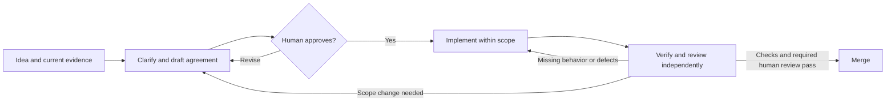

# Development workflow

This guide records how the developer maintains this portfolio MVP, with or without
AI assistance. It also gives future developers the context to continue the work.
Keep changes focused on a useful, working product that can be demonstrated.

Start with the [application glossary](../glossary.md) and [current architecture](../architecture.md),
then use this guide to set up a checkout and complete one ticket. The
[documentation index](../README.md) groups the other guides by task. This route
needs neither an AI agent nor provider credentials.

## Agree before building

Use this cycle for human or agent implementation. The principles apply to other
projects too: establish the facts, agree on the result, build within that agreement,
and compare the delivered result with it. The sections below map the cycle to this
repository's files and commands. See the [workflow glossary](glossary.md) for terms.



Before implementation or assignment, the human developer and implementer must
agree on the following. Record enough detail to distinguish a correct result
from a plausible but unwanted one.

- The problem and current behavior, with evidence from the checkout or a reproduction.
- The intended behavior, inputs, and outputs.
- Concrete examples or the expected user experience, including relevant failure cases.
- Constraints, acceptance criteria, and how each criterion will be checked.
- Included scope, explicit exclusions, and unresolved questions.

For a small change, keep the agreement in its ticket. For a substantial feature or
behavior change, write a concise specification under `docs/specs/` and link it from
the ticket. Create that directory when the first specification is needed. Use the
same points above, with sections only where they help. Do not copy the agreement
into several documents or add a specification for every edit.

Label a specification as draft until the human approves it. Record the approval,
its date, and the agreed scope in the ticket or specification, referring to the
approval conversation where available. Approval of a concrete agreement already
given in the conversation counts; do not ask again for the same scope. A request
to investigate, a ticket's existence, or passing preflight does not approve a build.

Resolve questions that affect behavior, scope, inputs, outputs, or acceptance
before implementation. State minor assumptions that do not affect the agreement.
The implementer can choose routine code structure and test details within scope.
If new evidence requires more behavior or changes an approved constraint, explain
the proposed change and obtain approval before implementing that expansion.

Use an ADR when a lasting design choice needs its alternatives, reasoning, and
consequences recorded. Update the architecture overview when the implementation
changes. A specification describes the agreed result; an ADR explains a decision;
the architecture overview describes the current system. Mark what is decided,
implemented, and verified separately. Preserve decision history when plans change.

### Assign responsibilities

| Role | Responsibility |
|---|---|
| Human developer | Explain the goal and constraints, resolve product choices, approve the agreement and scope changes, and judge content or behavior that automated checks cannot prove. |
| Implementer, human or agent | Inspect the current state, draft the agreement, implement approved scope, keep related documentation accurate, and provide check results and known gaps. |
| Independent reviewer, another person or agent | Read the agreement, inspect the actual diff and evidence, and report defects, omissions, unnecessary additions, and deviations. Do not treat the implementer's summary as proof. |

An independent agent review does not replace required human product or content
judgment. For concurrent work, give each writer a separate branch and worktree.
A reviewer can inspect the implementation checkout read-only.

## Set up offline development

The pipeline supports Python 3.10 or newer. Use Python 3.14 for the locally
verified development baseline. The ticket tool alone supports Python 3.9 or
newer; its CI matrix checks 3.9 and 3.14 on Windows and Linux. That matrix does
not test the full pipeline across every Python version.

From the repository root, create a virtual environment and install dependencies:

```powershell
python --version
python -m venv .venv
.\.venv\Scripts\python.exe -m pip install -r pipeline/requirements.txt
```

On Windows, activate it with `.\.venv\Scripts\Activate.ps1` if your shell permits
scripts. Otherwise use `.\.venv\Scripts\python.exe` in place of `python` in every
command below. On macOS or Linux, activate with `source .venv/bin/activate`, then
run `python -m pip install -r pipeline/requirements.txt`.

Dependency installation needs package access, but subsequent offline checks need
no network or credentials. Do not create `.env` for offline development. The
requirements include the PDF readers, workbook writer, and provider SDKs; an
installed SDK does not require a configured provider.

Run the full local checks from the repository root:

```powershell
$env:PYTHONIOENCODING='utf-8'
python -m unittest discover -s pipeline/tests -p 'test_*.py'
python scripts/check_tickets.py
git diff --check
```

On macOS or Linux, set `export PYTHONIOENCODING=utf-8` instead. Check each command's
exit status separately. The pipeline tests use synthetic files, fake clients, and
saved responses. The ticket check runs its own tests and validates the backlog.
Report warnings as review items even if a command exits successfully. Existing
ticket CI does not replace the full local pipeline run.

Inspect the CLI without a provider:

```text
python pipeline/pipeline.py --help
python pipeline/pipeline.py "path/to/your/course" add-exam --help
```

Use [new course setup](../guides/new-course-setup.md) to prepare your own course
folder and run `add-exam --dry-run`. The dry run lists selected paths and performs
no analysis. That guide also explains input selection and the limits of the
current candidate-only workflow.

## Choose and verify one ticket

```text
git status --short --branch
python scripts/tickets.py next
python scripts/tickets.py show ID
python scripts/tickets.py preflight ID
```

Replace `ID` with the selected ticket's ID. Read its whole record and references.
The permanent backlog is in `tickets/issues/`; the
[status table](../../tickets/TICKET_STATUS.md) is generated from
those records. Do not edit the table or remove dependencies to start blocked work.

Reproduce the problem or inspect relevant code and tests. Identify likely files
and record actual evidence when preflight requests verification:

```text
python scripts/tickets.py verify ID --result still_valid --checker "Your name" --evidence "The check performed and the remaining problem"
python scripts/tickets.py preflight ID
```

Use `partially_resolved` when only part remains. Relevant uncommitted changes make
verification provisional; recheck the committed revision before treating it as
current evidence. The [ticket workflow](ticket-workflow.md) explains other
verification results and closure reasons. Complete the
[shared agreement and human approval](#agree-before-building) before starting or
assigning implementation. Preflight readiness establishes ticket eligibility,
not approval of its proposed scope.

For this repository, invoke `$exam-next-ticket` using the
[project-local skill](../../.agents/skills/exam-next-ticket/SKILL.md). It uses the
ticket CLI, checks that it is running in this project, and coordinates model
selection and implementation. Select the entry with that exact name and local
path; the personal `$next-ticket` skills remain unchanged for other projects.
If the local entry is not available in the current session, start a new task in
this checkout or explicitly ask the agent to read the linked `SKILL.md`. A
request to only inspect or select a ticket does not authorize implementation.

## Choose the branch base

```text
git fetch origin --prune
git branch -vv
git log -1 --oneline origin/main
git log -1 --oneline origin/codex/mvp-two-stage
```

The current two-stage implementation is on `codex/mvp-two-stage`. Use its fetched
origin branch for work that depends on that implementation. The
[branch consolidation record](../research/branch-consolidation-2026-09-17.md)
explains the retained branches. Local `main` was preserved with history unrelated
to `origin/main` and no upstream. Do not assume they match or use `git pull` on
local `main` as a setup step. Independent work starts from the verified remote
`main` when it does not need the MVP changes.

A separate branch helps when the ticket needs its own pull request, a different
base, or isolation from other work. Keep small related follow-ups on a suitable
existing non-`main` branch when another branch adds no value. Never implement on
`main`. Preserve unrelated changes and stop if they overlap the ticket.

Before creating a branch, report its source as
`codex/ID-short-name <- origin/codex/mvp-two-stage @ SOURCE_COMMIT`, replacing
`SOURCE_COMMIT` with the fetched commit. For a new MVP-dependent ticket:

```text
git rev-parse origin/codex/mvp-two-stage
git switch -c codex/ID-short-name origin/codex/mvp-two-stage
python scripts/tickets.py move ID IN_PROGRESS
```

The move updates the authoritative ticket and generated table together. If tasks
run concurrently, give each one a separate branch and worktree. Do not let two
agents edit the same working tree. Preserve recovery branches and worktrees.

## Implement and verify the change

Implement one reviewable outcome from the approved agreement. Keep examples,
acceptance criteria, and exclusions available while working. Record new work in
a follow-up ticket or ask for an approved scope change before building it.
Use focused checks for the behavior while developing, then run the full checks
above. For example, CLI changes can use:

```text
python -m unittest discover -s pipeline/tests -p 'test_cli_outcomes.py' -v
```

When agents create or edit files containing human-readable text, they must use
both `technical-writing` and `unslop`. This includes guides, specifications, ADRs,
READMEs, tickets, reports, and agent instructions, plus prose comments in code.
Apply the same writing checks to pull request descriptions and commit messages.

- Read the installed `technical-writing/SKILL.md` before drafting. Organize the
  content for its reader, keep sections focused, and use bullets, numbered steps,
  or tables when they make the information easier to follow.
- Read and apply `unslop/SKILL.md` before handoff. Remove filler and awkward
  phrasing while preserving requirements, technical meaning, and code syntax.
- Have the independent reviewer check readability as well as correctness.
- If either skill is unavailable, report which one is missing. Do not claim that
  the required writing check is complete without applying both skills.

For documentation, compare commands with `--help`, resolve local links relative
to each document, and check behavior claims against production code and tests.
Use synthetic data for new fixtures. Never commit real papers, extracted text,
credentials, local scratch evidence, or generated course reports.

Review before staging and commit one verified outcome:

```text
git status --short
git diff --stat
git diff
git add -p
git diff --cached --check
git diff --cached
git commit -m "Describe the verified change"
```

Stage new files by explicit path. Avoid `git add .` when unrelated files exist.
Before review, compare the actual pull request base and committed head:

```text
python scripts/tickets.py impact --base BASE_COMMIT --head HEAD_COMMIT
git diff --check BASE_COMMIT...HEAD_COMMIT
git diff --stat BASE_COMMIT...HEAD_COMMIT
git diff BASE_COMMIT...HEAD_COMMIT
```

Replace both placeholders with actual commits. For an MVP-dependent pull request,
the base is the current `codex/mvp-two-stage` revision, not an assumed `main`.
Review impact warnings and affected tickets; a path match does not prove a ticket
is resolved. Push completed commits with `git push -u origin YOUR_BRANCH`.

## Hand off for review or completion

Have an independent reviewer compare the actual product and diff with the approved
agreement. Check each acceptance criterion against evidence, and report missing
behavior, deviations, and unnecessary additions. Re-run affected checks after
fixes. Return to agreement if a fix needs new scope. Update any documentation whose
claims changed, including relevant specifications, ADR status, and architecture.
Report added or removed relationships between documents and code, and newly found
affected files, with the reason each needs review.

Open one pull request for the ticket, with its actual source branch as the base.
Use a draft when early feedback can change the design. Explain the change,
included and excluded scope, exact checks and results, risks, rollback, AI
assistance, and the concrete human checks still required. Compare the description
with the diff before publishing it. The
[Git and pull request research](../research/git-and-pull-requests-for-ai-development.md)
provides background for splitting larger work and reviewing recovery options.

When a person must judge behavior, output, prose, or platform-specific results:

```text
python scripts/tickets.py move ID TO_REVIEW
```

Provide a short numbered checklist with commands or paths and expected results.
Do not claim that this transition satisfies dependent tickets. After review passes,
record the real reviewer and evidence using the closure options in
`python scripts/tickets.py move --help`. For example:

```text
python scripts/tickets.py move ID DONE --reason implemented --commit COMMIT --reviewed-by "Reviewer name" --evidence "The completed review and checks"
```

If automated checks fully prove the outcome and no human judgment is needed,
project policy allows completion with the required closure evidence. Do not invent
review approval. Implemented prerequisites need recorded review evidence before
they unblock dependents. The project-local `exam-next-ticket` skill follows these
same closure rules.

Merge into the stated base after checks, independent review, and any required
human review pass, within the developer's merge authorization. Review impact
against the current base before merging. For stacked pull requests, use the branch
directly below as each base and merge from the bottom upward. Ticket completion
records evidence; it does not itself merge a branch.

## Know what enforces the workflow

| Mechanism | What it does now | What still needs judgment or instructions |
|---|---|---|
| Ticket CLI and `scripts/check_tickets.py` | Validate ticket structure, references, transitions, prerequisites, and recorded verification and closure evidence. | They cannot prove that a written account is true or that the human approved the product scope. |
| Ticket `impact` and `audit` | Flag affected tickets and recorded evidence that needs review. | A matching path is not proof that a requirement is satisfied. The reports do not detect every contradictory document. |
| Offline tests and Git diff checks | Exercise covered behavior and detect reported test or whitespace failures. | Passing checks do not establish that the product is useful or stays within scope. |
| `AGENTS.md` and local skills | Instruct agents to seek agreement, stay within scope, use separate worktrees, and provide review evidence. | These are behavioral instructions, not automatic enforcement or a filesystem sandbox. |
| Human and independent review | Compare the result with the approved agreement and assess defects, omissions, and unnecessary additions. | Record real decisions and evidence. An agent cannot supply the human's approval. |

The [documentation dependency tool](../specs/doc-dependencies.md) provides
`check`, `build`, `impact`, and `discover`. Covered documents now contain initial
dependency blocks. Use the specification's before-edit and before-review commands
to query related files and refresh local Mermaid and JSON maps. A current passing
check establishes structural coverage. It does not establish semantic completeness.
Comparisons with commits before the rollout retain explicit historical coverage gaps.

The tool validates structure and reports review candidates. It cannot prove
semantic consistency or human approval. There is no automatic completion gate
or CI integration for documentation dependencies.

## Use skills for the task

Skills are instructions for agents. Human developers can follow this guide and
use the CLI directly. The first two entries are repository-local. The writing
skills are required for agent-authored prose. Other skills follow the triggers
in the table; entries marked optional remain optional. Find installed skill
locations in the active skill catalog.

| Skill | Use it when | Instruction location |
|---|---|---|
| `exam-next-ticket` | Select the next eligible ticket and, after scope approval, implement it through the project CLI. | [Local skill](../../.agents/skills/exam-next-ticket/SKILL.md) |
| `graft` | Find relevant implementation, callers, or change impact before reading source. | [Local skill](../../.agents/skills/graft/SKILL.md) |
| `grill-with-docs`, optional | Product choices or terminology need clarification before agreement. | Installed `grill-with-docs/SKILL.md`, for example `~/.agents/skills/grill-with-docs/SKILL.md` |
| `to-spec`, optional | The conversation is clear enough to draft a substantial feature's specification. | Installed `to-spec/SKILL.md`, for example `~/.agents/skills/to-spec/SKILL.md` |
| `technical-writing` and `unslop`, required for agent-authored prose | Create, edit, or review human-readable text using the writing checks above. | Installed `technical-writing/SKILL.md` and `unslop/SKILL.md` in the active skill catalog |

Read the exact installed skill before using it. If an optional skill is absent,
use the agreement checklist above. For this repository, ask `to-spec` to draft a
concise local document. Its general publishing instructions do not authorize
external issue publication or automatic readiness here. Keep the draft subject to
human approval. Use clarification skills for unresolved decisions, not to repeat
questions already answered. Skills do not expand the approved scope.

## Optional live-provider setup

Live analysis is separate from onboarding and offline verification. Before a live
run, get approval for the provider, exact Stage 1 and Stage 2 model IDs, and
expected cost. Budget for batching and retries; two stages can make more than two
requests. A model ID containing `free` is not a cost guarantee.

Confirm that the paper may be sent to the chosen provider and check its data
handling terms. The request includes extracted question text, retained context,
and analytical prompts. Candidates can retain source text and private paths.
Keep course data and captures local; use synthetic examples in commits or issues.

Copy [.env.example](../../.env.example) to `.env` at the repository root, then edit it
locally. Set `LLM_PROVIDER`, `LLM_MODEL_STAGE1`, `LLM_MODEL_STAGE2`, and the matching
API key. Supported providers are Anthropic, DeepSeek, OpenAI, OpenRouter, and
UnoRouter. The CLI loads `.env` for live `add-exam`; existing environment values
take precedence. Never paste keys into commands, prompts, logs, or commits.

Set request budgets to the selected models' actual limits using the
[model request limits guide](../guides/model-request-limits.md). After approval,
follow [new course setup](../guides/new-course-setup.md) to save a candidate.
Independent review and candidate promotion remain unavailable in the MVP CLI.
OCR is outside the MVP and needs a separate approved change with an expected cost.

## Dependencies

<!-- doc-dependencies:start -->
| File | Reason | Review when |
|---|---|---|
| `AGENTS.md` | Explains the repository instructions for agreement, implementation, and review. | Approval, branch, verification, review, or completion rules change. |
| `docs/development/glossary.md` | Uses the agreed meanings of scope, specification, decision, and verification. | Workflow terminology or evidence distinctions change. |
| `docs/development/ticket-workflow.md` | Summarizes ticket selection, verification, state transitions, and closure. | Ticket commands or lifecycle procedures change. |
| `docs/specs/doc-dependencies.md` | Describes how dependency checks support documentation review. | Commands, coverage, review duties, or enforcement status change. |
| `docs/research/branch-consolidation-2026-09-17.md` | Uses recorded branch lineage to explain the MVP base and retained main history. | A correction to the recorded lineage changes branch-selection guidance. |
| `docs/research/git-and-pull-requests-for-ai-development.md` | Applies the research conclusions about reviewable changes and recovery. | Adopted Git practices or the boundary between proposals and current rules changes. |
| `.agents/skills/exam-next-ticket/SKILL.md` | Explains when the local ticket skill runs and what it requires. | Skill trigger, approval, delegation, or closure instructions change. |
| `.agents/skills/graft/SKILL.md` | Identifies the local code-discovery skill and when to use it. | Skill trigger, location, or retrieval instructions change. |
| `scripts/tickets.py` | Publishes ticket commands and their enforcement limits. | CLI arguments, preflight, transitions, or verification behavior change. |
| `scripts/check_tickets.py` | Defines the local tooling check developers must run. | Tests executed, validation behavior, or exit handling change. |
| `.github/workflows/tickets.yml` | States the CI platforms, Python versions, and limits of automation. | CI matrix, required checks, or impact reporting change. |
| `pipeline/requirements.txt` | Supplies the dependencies used by the setup instructions. | Dependency lists, pins, or installation requirements change. |
| `.env.example` | Supplies the provider configuration template used in live setup. | Environment variable names, providers, or defaults change. |
| `pipeline/pipeline.py` | Documents offline commands, live startup, and disabled MVP features. | CLI help, environment loading, provider setup, or availability gates change. |
| `pipeline/exam_roi/llm.py` | Documents supported providers, credentials, and model configuration. | Providers, credential aliases, model setup, or request budgeting change. |
| `docs/guides/model-request-limits.md` | Directs live setup to the request-budget rules. | Budget variables, defaults, or setup requirements change. |
<!-- doc-dependencies:end -->
