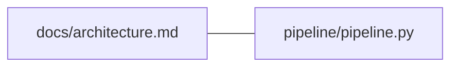

# Documentation dependency technical reference

**Approved on 2026-09-19; tool implemented in tickets 30 and 31.** This is the detailed contract for the
[human-facing specification](doc-dependencies.md). Read that page first for the workflow,
coverage, ownership, review responsibilities, and vocabulary.

Use this reference when implementing or checking a specific rule:

- [Declaration parsing](#declaration-parsing)
- [Commands and exit status](#commands-and-exit-status)
- [Git snapshots and historical safety](#snapshots-comparisons-and-historical-safety)
- [Focused results and generated maps](#focused-results-and-local-artifacts)
- [JSON fields](#versioned-json-contract)
- [Discovery rules](#discovery-rules)
- [Implementation and acceptance](#implementation-boundary-and-acceptance)

## Declaration parsing

- Markers occupy their own lines. A heading is optional and has no parsing meaning.

### Table syntax

- Require the exact header cells `File`, `Reason`, `Review when`, in that order.
  The separator has three cells, each at least three hyphens with optional colons.
  Leading/trailing cell whitespace and outer pipes are optional.
- After trimming a cell, `File` is one repository-relative POSIX path wrapped in
  one pair of backticks. Do not accept Markdown links, anchors, queries, absolute
  paths, drive prefixes, backslashes, `.` or `..` segments, or repeated slashes.
  Resolve against the repository root, never the owner's directory.
- Paths are case-sensitive even on Windows and must match the snapshot inventory.
  Spaces and Unicode are allowed. Literal pipes, backticks, and control characters
  in paths are unsupported and produce a diagnostic rather than guessed parsing.
- Reason and Review when are nonempty, single-line plain text. Decode `\|` to a
  literal pipe and `\\` to a backslash. Reject other backslash escapes, multiline
  cells, HTML breaks, nested tables, and empty cells. Preserve internal whitespace
  after trimming outer whitespace; do not interpret Markdown in these two cells.
- Allow blank lines inside the block. Otherwise its contents are only the header,
  separator, and rows. Header and separator alone explicitly declare no known
  relationships. An absent block does not mean an empty block.
- Reject unmatched, reversed, nested, or repeated markers. Ignore examples inside
  CommonMark fenced code with backticks or tildes; indented marker/table examples
  are unsupported. Real markers must start at column one.
- Reject self-relations and duplicate unordered pairs, within or across owners,
  even when cells match. Report both locations. Retain one row per pair only after
  the author resolves the error; do not silently deduplicate conflicting input.
- Cycles are valid. Impact uses a visited set, terminates, and returns each file
  once. The relationship is a review association, not a build dependency order.

### Target existence

- A missing target is an error in its own snapshot.
- Historical relationships are validated against their historical inventory, so a legitimate later deletion does not retroactively break the old graph.
- A new declaration cannot point to a future file that has not been staged or committed into the selected inventory.

## Commands and exit status

- These commands and initial declarations are implemented. Semantic review remains separate from structural coverage.
- Run from any directory inside the repository; all displayed and supplied file paths are relative to its root.
- Git is required for tracked inventories and historical reads.
- Git change detection is optional and runs only for a selected comparison.
- No command silently uses all pending changes as its seed set.
- Every command validates all owner declarations; discovery filters limit candidate extraction only.

```text
python scripts/doc_dependencies.py check [--ref REV | --index] [--against-artifacts DIR] [--format text|json]
python scripts/doc_dependencies.py build [--ref REV | --index] [--output-dir DIR] [--format text|json]
python scripts/doc_dependencies.py impact (--file PATH ... | --base REF --head REF [--merge-base] | --staged | --unstaged) [--depth N] [--limit N] [--format text|json]
python scripts/doc_dependencies.py discover [--file PATH ...] [--format text|json]
```

### Output format

- `--file` is repeatable; the ellipsis denotes additional `--file PATH` options.
- `--format` defaults to `text`.
- Text prints a concise summary, selected records, and diagnostics.
- JSON prints one schema-versioned object and no surrounding prose.
- Diagnostics also belong in that object; never mix progress text into JSON.
- Routine diagnostics go to stdout with the result.
- Fatal failures that prevent a result, including argument parsing and output serialization failures, use stderr.

### Command behavior

| Command | Inputs and result |
|---|---|
| `check` | Validates all owners and declarations in the worktree by default, or in the explicit index/commit snapshot. Prints counts, coverage, and diagnostics; does not list the whole graph. Optional `--against-artifacts` also verifies both saved map files against the fresh graph. Writes nothing. |
| `build` | Uses the same snapshot choices and validation. On a valid, complete graph writes `graph.json` and `graph.md` to the output directory, then prints their paths and graph digest. Default directory is `.scratch/doc-dependencies/`. Validation must finish before artifact writing begins. |
| `impact --file` | Uses the current worktree graph and exactly the named paths as seeds. No diff runs. Each seed must be tracked in the current index and exist as a regular worktree file. A missing seed exits 2 and directs the user to a comparison mode such as `--unstaged`. Prints selected nodes, relationships, reasons, review conditions, and provenance. |
| `impact --base --head` | Resolves both commits, reads their inventories and graphs, and uses their explicit comparison as seeds. Ignores index and worktree changes. Both flags are required together. |
| `impact --staged` | Compares HEAD with the index, using those two graphs and inventories. Requires HEAD to exist and ignores unstaged content. |
| `impact --unstaged` | Compares index with worktree, using those two graphs and inventories. Untracked files are excluded. |
| `discover` | Scans all worktree owners or exactly the owners named by repeated `--file`; a selected non-owner is a usage error. Prints undeclared candidates and evidence, never changes a declaration. |

### Query limits

- Exactly one impact input mode is required.
- `--depth` is a positive integer, default 1, counting undirected hops from the seeds.
- `--limit` is an optional positive maximum number of selected nodes.
- Default output has no hidden cap.
- `discover` has no sampling or ranking cap.
- Current snapshot commands never use saved artifacts as authoritative inputs.
- There is no configurable semantic engine, provider, watch service, or generic rules file in this version.

### Exit codes

| Exit | Meaning |
|---|---|
| 0 | Requested structural operation completed, with no errors or incomplete results. Nonempty impact and discovery candidates do not cause failure. This says nothing about semantic completeness. |
| 1 | Validation or saved-artifact failure, such as a malformed block, current coverage gap, missing target, duplicate pair, or stale/malformed map. |
| 2 | Invalid arguments or operational failure, such as unknown revision, unsupported repository state, unreadable required input, or failed write. |
| 3 | Otherwise valid but incomplete result, such as historical coverage gaps or a requested output limit omitting selected nodes. Human follow-up is required. |

### Failure handling

- Operational failure takes precedence over validation failure, which takes precedence over incompleteness.
- Known diagnostics and partial impact may still be returned, with `complete: false`.
- Never print a passing summary after skipping an unreadable file.
- `build` leaves existing artifacts untouched on validation or incomplete results.
- An I/O failure may leave a mismatched pair, as described below.
- An empty impact result is valid only when the selected inputs and graph justify it.
- Unknown paths or failed comparisons are errors, never empty successes.

## Snapshots, comparisons, and historical safety

### Current files and staging

- For worktree reads, take the eligible path inventory from the index and content from disk.
- Staged additions participate; staged deletions do not.
- A tracked path missing on disk is absent in the worktree snapshot and appears as a deletion in an unstaged comparison.
- Unmerged index entries are an operational error.
- Commands report that untracked content was excluded, without reading it.
- They must not read ignored files, follow symlinks, fetch, modify the index, or invoke a provider.

- A newly created document participates after `git add` places it in the index.
- Before staging, the author must inspect `git status --short` for new documents; a passing check does not cover them.
- A renamed but unstaged new path is likewise untracked until staged.
- This limitation appears in every worktree result.

### Commit comparisons

- Without `--merge-base`, `--base B --head H` means the two endpoint trees B and H, not the three-dot diff.
- With it, resolve their unique merge base M and compare M to H.
- Read the graph at the effective base M, not at the requested base B.
- Missing or multiple merge bases are errors.
- Record requested refs, resolved commits, effective base, and mode.
- Never guess an upstream, `main`, or pull request base.

### Removed relationships

- Read both endpoint graphs and union their relationships before impact traversal.
- Keep before and after provenance separately, including changed cell text and old owners.
- A deleted owner and its removed rows remain reachable through the old graph.
- A relationship removed in H can still select a document for review.
- Use the existing ticket history impact approach as a possible implementation pattern; its API and ticket graph remain separate from this tool.

### Renamed files

- Use Git name-status with NUL-separated paths and rename detection at 50 percent.
- Record reported rename pairs and seed both old and new names.
- Keep paths as separate nodes with `renamed_from`/`renamed_to` links; a rename is not a declaration edge.
- For traversal only, a rename connects aliases at zero hop cost, so old references and new references both contribute.
- If Git reports delete plus add, preserve that result and seed both.
- Do not infer a rename from similar prose.
- Path changes of a pair explained by recorded renames are reported as a rename, with any reason, trigger, or owner change reported additionally.

### Changed declarations

- Relationships present in both snapshots can change their reason, review condition, or owner.
- Compare decoded text and record each change.
- Line-number movement alone is provenance movement, not a relationship change.
- An unchanged file reached through an old edge still needs a review decision; it need not be edited if the review establishes that its claims remain correct.

### Missing historical declarations

- Validate snapshots independently.
- In a current snapshot, a missing required block is a coverage error.
- In an older endpoint only, a missing block is a historical coverage warning that sets `complete: false` and exit 3 unless another error has higher precedence.
- Malformed old blocks, duplicates, and broken old targets remain errors.
- Preserve known impact and list every owner with unknown historical edges.

### First rollout

- The first rollout can pass a current `check` while historical `impact` remains incomplete.
- Bootstrap acceptance requires a human to review the changed files and the listed older owners manually, record that evidence in the implementation ticket, and acknowledge the historical gap.
- The tool still exits 3 for that comparison; approval does not rewrite history or manufacture a complete graph.
- Once both endpoints have complete declarations, normal comparisons can pass.

## Focused results and local artifacts

### Graph contents and token usage

- Graph nodes are required owners, including isolated owners, and declared targets.
- Impact also includes each explicit seed even when it has no relationships.
- The full tracked inventory supports validation and digests; it is not the node list.
- Parse all required owners locally so reverse lookup cannot miss a declaration outside the requested area.
- The CPU scan sends nothing to a model and consumes no LLM tokens itself.
- Only selected output pasted or returned to an agent consumes model context.
- Full scanning and focused presentation are separate operations.

### Query examples

Before-edit commands:

```text
python scripts/doc_dependencies.py impact --file pipeline/pipeline.py
python scripts/doc_dependencies.py impact --file docs/architecture.md --depth 2 --format json
```

- The first result includes the seed and every directly related document, regardless of declaration direction.
- The second explicitly requests a wider neighborhood.
- Each result reports requested depth, seed paths, selected node/edge counts, and whether nodes remain outside that depth.
- That last fact is ordinary query scope, not truncation or structural failure.
- Depth 1 does not claim transitive closure.

### Ordering and omitted results

- Select nodes by breadth-first distance, then repository path.
- If `--limit` omits nodes within the requested depth, report total eligible count, returned count, `omitted_count`, and `complete: false`, and exit 3.
- Never clip silently.
- Emit all relationships between returned nodes and counts for omitted relationships.
- Diagnostic counts and coverage gaps must not disappear under an output limit.

### Mermaid output

- `build` writes a complete Markdown document with a Mermaid `flowchart LR`, a legend, snapshot provenance, digest, and relationship table.
- Use stable node IDs assigned from sorted paths, safely escaped labels, and undirected edges.
- The table preserves owner, target, reason, review condition, and source location; the drawing alone need not display long prose.
- A minimal shape is:



### Output location and interrupted writes

- Maps live under ignored `.scratch/doc-dependencies/` by default, consistent with [local generated-output policy](../repository-structure.md#location-policy).
- Custom output directories must resolve inside an ignored repository directory; reject tracked paths, repository escapes, symlinked directories, and directories whose existing named outputs lack this tool's format marker.
- JSON uses its artifact kind; Markdown starts with `<!-- doc-dependencies:graph:v1 -->`.
- Only replace the two named artifacts.
- Render both fully and write temporary files before replacing each output.
- An I/O failure or interruption may leave one new and one old file; never report success then.
- The next check rejects mismatched digests or bytes.
- Working artifacts remain ignored. The owner authorized one tracked, commit-pinned
  publication at `docs/development/dependency-map.md`. It wraps the generated snapshot
  with refresh instructions and its own dependency block; it remains in owner coverage.
- The CLI still writes only to ignored directories. Publish by copying the generated
  content as described on that page. The artifact freshness check covers the local
  artifact pair, not the wrapped publication.

### Source digest

- The snapshot digest is SHA-256 of UTF-8 canonical JSON with sorted keys, compact separators, literal Unicode with `ensure_ascii=False`, and no final newline, for this exact object: `scope_version: 1`, `schema_version: 1`, `inventory`, and `owners`.
- `inventory` is path-sorted records with `path` and `type`, where type is `regular`, `symlink`, or `submodule`.
- `owners` is path-sorted records with `path` and `sha256`, hashing each owner's raw bytes.
- Decode owner content as strict UTF-8, accepting one leading UTF-8 BOM; invalid encoding is a validation error.
- Hash bytes before decoding.
- Inventory covers target existence/type changes; code-content changes alone do not alter the declared graph.
- No timestamps, absolute paths, or random IDs enter artifacts.
- Identical resolved snapshots, provenance, and options produce byte-identical files.

### Freshness checks

- Regenerate after changing owner content, tracked membership, or scope/tool version.
- Before using a saved map run `check --against-artifacts .scratch/doc-dependencies`.
- It compares the fresh snapshot digest and exact expected artifact bytes, and checks both files exist.
- A missing, edited, mismatched, old-schema, or stale file fails with exit 1.
- Rebuild and recheck; never trust file age.
- `impact` always reads fresh sources and needs no prior `build`.

## Versioned JSON contract

- All result JSON uses UTF-8, literal Unicode, two-space indentation, sorted object keys, and a final newline.
- Arrays follow the ordering below.
- Version 1 requires the stated fields; nullable fields remain present.
- Reject unsupported versions.
- Shape changes require a version increment.
- The CLI implements this contract without a separate JSON Schema file.

### Result envelope

- Every envelope has `schema_version: 1`, `command`, `kind`, `valid`, `complete`, `snapshot`, `coverage`, `diagnostics`, and `data`.
- Command is one of the four CLI names.
- Kind is `result` for stdout or `graph_artifact` for `graph.json` from build.
- `valid` is false if any validation error exists or validation could not finish.
- An older missing block alone leaves it true.
- `complete` is false for any skipped, unknown required input or omitted requested result, including historical gaps.
- Neither boolean certifies semantic completeness or approval.

### Snapshot fields

- `snapshot` has `mode`, `requested_base`, `requested_head`, `base_commit`, `head_commit`, `effective_base`, `before_digest`, `after_digest`, and `untracked_excluded`.
- Modes are `worktree`, `index`, `commit`, `files`, `endpoints`, `merge_base`, `staged`, `unstaged`.
- Requested fields are ref strings or null; `--ref` uses `requested_head`.
- Commit fields are full object IDs or null.
- For comparisons, base/head commits resolve requested refs or identify HEAD where an endpoint derives from it; index/worktree endpoints have null commit fields.
- `effective_base` is the compared base commit or null for a non-commit endpoint.
- Single snapshot worktree/index modes record containing HEAD in `head_commit` as context, not a claim that content is committed.
- Digests describe each actual snapshot using the algorithm above; inapplicable or unavailable values are null.
- `untracked_excluded` is true when any worktree content is read, otherwise false.

### Coverage and diagnostics

- `coverage` contains `before` and `after`, each null or an object with integer `required`, integer `declared`, and path-sorted `missing` strings.
- Single snapshot commands use only `after`.
- Diagnostics contain `code`, `severity`, `snapshot`, `path`, `line`, `message`, and Boolean `review_required`.
- Severity is `info`, `warning`, or `error`; snapshot is `before`, `after`, or null.
- Path is a string or null, line is a positive integer or null.
- Sort by snapshot, path, line, code, then message, with null first.
- Stable codes include `missing_block`, `invalid_table`, `missing_target`, `duplicate_pair`, `historical_coverage_gap`, `stale_artifact`, `output_limited`, `discovery_missing_target`, and `discovery_ambiguous_reference`.
- Discovery-only warnings use the final two codes, require review, and do not change validity, completeness, or exit 0.
- They assert uncertainty about a suggestion.

### Command data and shared records

The following shapes define `data` and its shared records.
- All counts are nonnegative integers.
- Paths and ordinary strings sort by Unicode code point.

| Record or result | Required shape and order |
|---|---|
| Counts | Object with integer `nodes`, `edges`, and `owners`. |
| Graph | Object with `nodes` and `edges` arrays. Nodes sort by path; edges by sorted endpoint pair. |
| Node | `path` string, `kind` as `document` when it is an included owner in either snapshot, otherwise `file`; `present_in` array containing `before`, `after` in that order when present; nullable path strings `renamed_from`, `renamed_to`. |
| Edge | `pair` with two sorted path strings; `declarations` array sorted by snapshot then owner. |
| Declaration | `snapshot` as `before` or `after`; string `owner`, `target`, `reason`, `review_when`, `owner_sha256`; positive integer `line`. Hashes have 64 lowercase hex characters. Both historical reasons survive. |
| Check stdout | `counts` object; `artifacts_checked` as supplied directory string or null. |
| Build stdout | `counts` object; `paths` object with `json` and `markdown` repository-relative output paths. |
| Build artifact | Graph object. Envelope kind is `graph_artifact`; command remains `build`. |
| Impact stdout | Graph fields plus `seeds` as sorted unique paths; `changes`; `relationship_changes`; positive `depth`; Boolean `outside_depth`; integer `eligible_count`, `returned_count`, `omitted_count`, `omitted_edge_count`. |
| Change | `status` as `A`, `M`, `D`, `R`, or `T` for type change; nullable `before_path`, `after_path`. Sort by before path, after path, status, with null first. Direct-file mode has an empty changes array. |
| Relationship change | `pair_before`, `pair_after` as sorted two-path arrays or null; `kinds` sorted strings from `added`, `removed`, `owner_changed`, `reason_changed`, `review_when_changed`, `renamed`. Sort records by before pair then after pair, null first. |
| Discovery stdout | `candidates` array sorted by owner then target. |
| Candidate | `owner`, `target` strings; `evidence` array sorted by line, kind, text. |
| Evidence | Positive `line`; `kind` as `inline_link`, `reference_link`, or `path_mention`; literal `text` string. These observations are not reasons or review conditions. |

### Example records

Example edge and diagnostic values within their respective arrays:

```json
{
  "edge": {
    "pair": ["docs/architecture.md", "pipeline/pipeline.py"],
    "declarations": [{
      "snapshot": "after",
      "owner": "docs/architecture.md",
      "target": "pipeline/pipeline.py",
      "reason": "Describes available command behavior.",
      "review_when": "A command becomes available or changes its outcome.",
      "line": 120,
      "owner_sha256": "aaaaaaaaaaaaaaaaaaaaaaaaaaaaaaaaaaaaaaaaaaaaaaaaaaaaaaaaaaaaaaaa"
    }]
  },
  "diagnostic": {
    "code": "historical_coverage_gap",
    "severity": "warning",
    "snapshot": "before",
    "path": "docs/guides/new-course-setup.md",
    "line": null,
    "message": "No block in the older snapshot; historical relationships are unknown.",
    "review_required": true
  }
}
```

- The example hashes and locations are illustrative, not verification evidence.

## Discovery rules

- `discover` examines prose outside dependency blocks and fenced code.
- It extracts local inline Markdown links, resolved reference-style Markdown links, and inline backtick spans containing exact repository paths.
- Resolve links relative to the owner, remove a fragment only for candidate matching, and percent-decode once.
- Inline path mentions are repository-relative.
- Do not inspect free-form words, code examples, external links, or ticket paths.
- Missing or ambiguous references produce warning diagnostics with literal evidence in the message; they have no resolved pair and are not candidates.
- Never guess an existing file.
- A link to a directory or an anchor in the same document yields no relationship.

- Only resolved pairs with no declaration in either direction become candidates.
- Group observations by ordered observing-document and target, retaining all evidence locations.
- Candidate `owner` means the observing document; semantic review chooses the eventual declaration owner.
- Opposite observations may yield two candidates.
- Respect coverage exclusions and path safety, and label results as suggestions.
- A link used solely for navigation may need no dependency.
- Conversely, a document may depend on a code contract it never links.
- Discovery cannot establish semantic completeness and must never edit declarations.

## Implementation boundary and acceptance

- Use a small standard-library CLI with functions for inventory/snapshot loading, block parsing, path validation, graph construction, candidate extraction, impact selection, and rendering.
- Keep Git and filesystem I/O at the boundary.
- Pass plain records into deterministic functions; avoid a framework, service, or inheritance hierarchy.
- A small helper module is acceptable if the script becomes hard to read.
- Tests belong under `scripts/tests/` with temporary synthetic repositories and pure-function fixtures.
- No test needs credentials, live model calls, or course data.

### Acceptance checklist

Offline regression tests cover the tool behavior below. Recorded independent
and human review provide the evidence for review responsibilities.

| Case | Required evidence |
|---|---|
| Coverage | Root README and all included docs require blocks; empty blocks pass; exclusions remain excluded; newly staged docs enter coverage. |
| Parsing | Valid escaping and spaces survive round trips; malformed markers, cells, duplicate pairs, self-edges, and unsafe paths identify exact locations and exit 1. |
| Ownership and traversal | One owned row supports queries from either endpoint; several reasons share one row; cycles terminate; owner moves are identified separately. |
| Missing targets | Wrong-case, nonexistent, directory, symlink, submodule, and ticket targets fail without reading excluded/private content. |
| Git selection | Direct paths run no diff; endpoint and merge-base modes differ on a divergent fixture; staged, unstaged, and untracked content follow their stated policies. |
| Historical loss | Deleted owner, removed edge, changed reason, renamed target, renamed owner, and delete/add without detected rename all retain old impact and provenance. |
| Legacy coverage | Old missing blocks return known impact plus gaps and exit 3; malformed old blocks exit 1; current check can pass independently; bootstrap review stays explicit. |
| Error integrity | Unknown refs, unmerged entries, unreadable files, and failed writes never produce false passing/empty results; interrupted artifact pairs fail the next check. |
| Focus | Single-hop default, explicit expansion, reverse lookup, stable ordering, and requested limits expose all omissions and their exit status. |
| Artifacts | Repeated builds are byte-identical; content/inventory changes invalidate maps; missing, manually edited, mismatched, and old-schema maps fail freshness checking. |
| Discovery | Links and path mentions produce evidence only; repeated references group; ticket/external/navigation-only references are handled as specified; semantic omissions still need review. |
| Review | Independent review checks the agreement and relationship reasons; a human resolves outstanding content choices before ticket closure. |

- Ticket 32 authors initial declarations under the owner-approved rollout. Human semantic review and historical-gap acknowledgment remain required.
- Hooks/CI, changes to `AGENTS.md` or skills, and automatic enforcement require later approved work. Maps can be generated from valid, structurally complete declarations.
- Ticket 29 delivered the approved specification. Tickets 30 and 31 implement and test the tool.
- The owner approved this design on 2026-09-19 and requested implementation.

## Dependencies

<!-- doc-dependencies:start -->
| File | Reason | Review when |
|---|---|---|
| `scripts/doc_dependencies.py` | Implements the exact Git, CLI, artifact, JSON, and failure contract. | Snapshot selection, flags, schema, rendering, or exit precedence changes. |
| `scripts/doc_dependency_graph.py` | Implements the exact declaration grammar and graph rules. | Coverage, parsing, ownership validation, traversal, digest, or discovery changes. |
| `scripts/tests/test_doc_dependencies.py` | Verifies Git snapshots, CLI results, and artifact safety against this contract. | Acceptance requirements or integration regression coverage change. |
| `scripts/tests/test_doc_dependency_graph.py` | Verifies pure declaration, history, traversal, and discovery behavior. | Grammar, graph semantics, or pure regression coverage change. |
| `docs/repository-structure.md` | Uses the repository policy for ignored generated map locations. | Generated-output locations or tracking rules change. |
| `docs/specs/doc-dependencies.md` | Both documents form one contract; this path owns their mutual relationship by Unicode order. | Coverage, ownership, commands, outputs, or acceptance rules change. |
<!-- doc-dependencies:end -->
